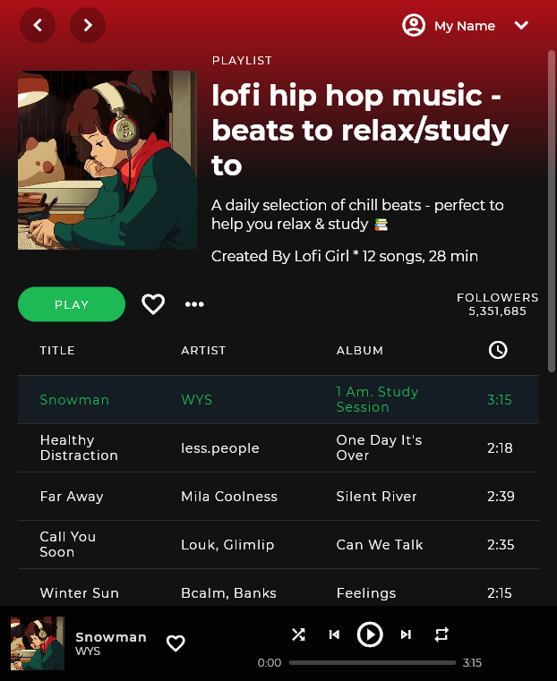

# Flutter Spotify Clone Desktop/Web UI

#### Following this [tutorial](https://www.youtube.com/watch?v=HJ1AlSrgZVQ), with the addition of my touch.

### The used Plugins:
* [Desktop Widow](https://pub.dev/packages/desktop_window)
* [Provider](https://pub.dev/packages/provider)
* [Lint](https://pub.dev/packages/lint)